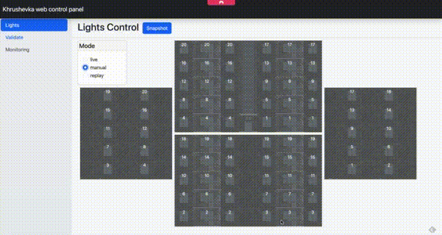
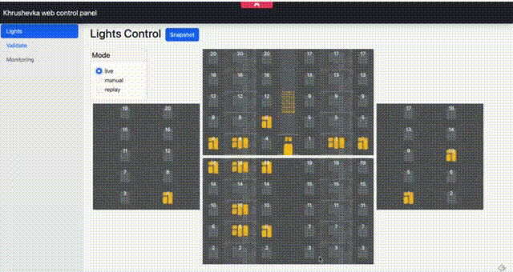

# khrushchevka
hobby project for the night-lamp

## Overview

The main concept revolves around creating a small-scale replica of a [Khrushchevka](https://en.wikipedia.org/wiki/Khrushchevka) with interior lights controlled by a Raspberry Pi. The control can be managed through a web interface or automated to simulate typical daily life, adding an element of randomness.

To manage the numerous lights, six MCP23017s are employed. These 16-bit I/O expanders utilize the I2C interface and are connected to the Raspberry Pi Zero.

All media assets, including 3D models, will be open-sourced soon—stay tuned for updates!

## Web control panel

Access the web control panel at http://127.0.0.1:8080 after starting the server.

In the control panel, you can manually toggle lights in rooms and the corridor, as well as select different modes.

The technology behind the web control panel heavily relies on [htmx](http://htmx.org) and Server-sent events. Find web page templates in the [web/templates](./web/templates) folder, and static files in [the web/static](./web/templates) folder.

## Modes
When a mode is selected, lights automatically turn off, and the mode initiates, turning on lights accordingly.

### Manual
The simplest mode allows you to manually control lights in rooms and the corridor by clicking on the respective area.

### Live
Lights operate automatically, simulating typical daily life with a touch of randomness.

### Repeat
On the top of the page there is a button "snapshot". 
While in the manual mode you could construct a lighting pattern and save it as a snapshot. 
Then you could switch to the repeat mode and the snapshot will be repeated with 100ms delay between the steps.

## Validate
The validate mode is used to check the wiring of the lights.
You could select a board and then click on the pin to turn it on.
